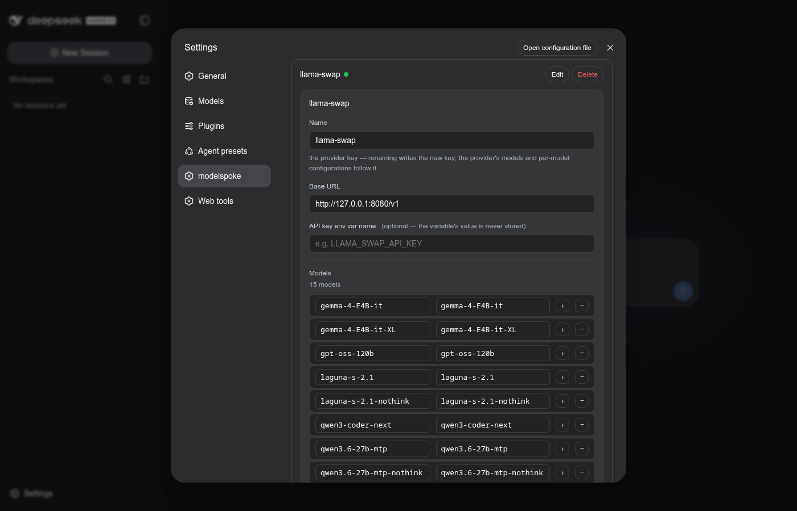
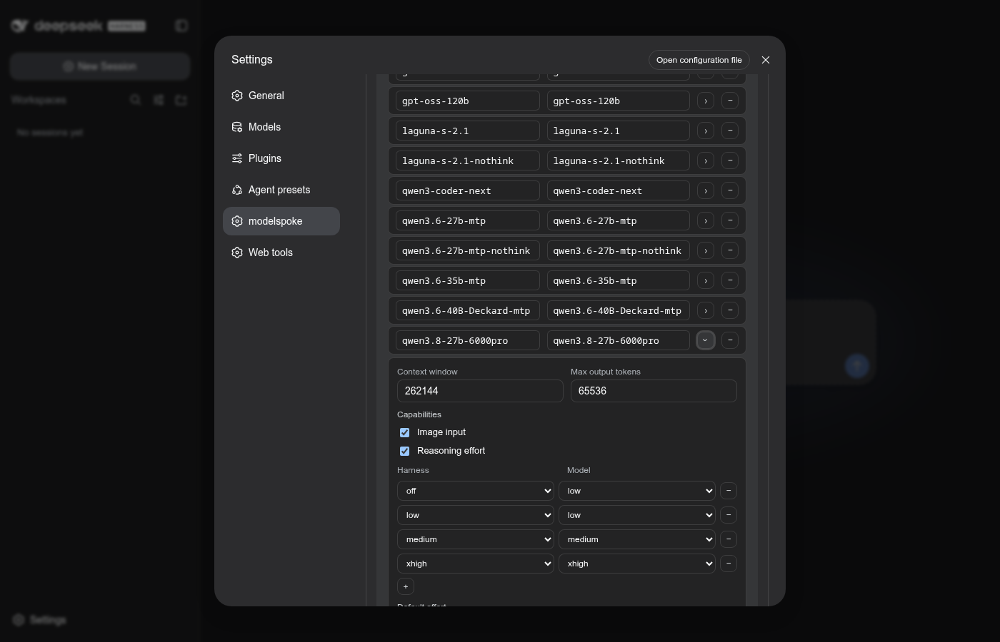

 

# modelspoke

[English](README.md) | 中文

一个 DeepSeek Harness 插件，管理到本地 OpenAI 兼容模型服务器的连接

## 功能

**llama-swap 与 Ollama 一等支持**

llama-swap 这个路由器强烈推荐本地模型收藏家使用 — 它可以作为模型能力跨
harness 的事实来源。modelspoke 理解 llama-swap 在其扩展的 OpenAI 兼容
端点上附加的能力数据。能力发现也支持 Ollama 的 API 扩展。

**常见模型的预设**

为了照顾没有完整能力发现的端点（例如 llama-server、vLLM、sglang），
modelspoke 内置了一张常见基础模型的能力表，供初始配置使用。

**功能完整的设置界面**

设置界面易于使用，覆盖所有日常字段（深层模板契约字段 — `compat` —
保留在文件里手工编辑）。可以覆盖预设和发现到的能力，并为同一个底层模型
维护多份设置配置。

**推理强度级别**

dsh 的自定义提供方功能没有任何设置推理强度的途径。Modelspoke 可以发现
支持的强度级别，并允许自定义从 UI 强度设置到模型支持取值的映射。

**图像输入**

具备多模态能力的模型很棒，但如果你通过 dsh 自定义提供方设置添加它们，
这个功能就不可用。Modelspoke 可以发现图像输入能力，也可以让你手动指定。
它还包含一个修复，解决会话聊天中内联图像缺少上游支持的问题。

## 安装与设置

### dsh

modelspoke 是一个**双面 Cordis 包**：node 半注册 LLM 适配器 +
`modelspoke:` 设置节；客户端半（同一个包）在 dsh 的 web UI 中渲染
**modelspoke** 设置节和首次运行的引导步骤。一行插件条目挂载两半。

1. **把它打进你的 dsh profile。** 在 profile 的 `package.json` 中把该包
   加为依赖（本地开发时用 pnpm `link:` 到一个 checkout），外加一条
   `dsh.profile.bundles` 条目，然后在 profile 目录里 `pnpm install`：

   ```json
   {
     "dependencies": {
       "modelspoke": "^0.1.0"
     },
     "dsh": {
       "profile": {
         "bundles": ["@deepseek-ai/dsh-base", "modelspoke"]
       }
     }
   }
   ```

   这个包自身不携带配置行 — `dsh.cordis.yml` 只有一行插件条目
   `name: 'modelspoke'`，在 `modelspoke:` 节存在之前以休眠状态启动
   （零路由）。

2. **（反）安装后重启一次 dsh**（dsh 按进程生命周期缓存包元数据）。
   之后，开发 checkout 中的内容变更只需 HMR — 无需重启。

3. **打开 modelspoke 设置页。** 在 dsh web UI 中，左侧栏底部的齿轮
   打开设置；在侧边栏选择 **modelspoke**，然后 **+ Add provider**：

   

4. **把它指向你的服务器。** 设置提供方的字段 — 名称、基础 URL、
   存放 API 密钥的*环境变量名*（无密钥的本地服务器可省略 —
   此时不发送认证头）、以及可选的默认推理强度（`minimal` … `max` —
   模型不接受的默认值会降级到最近的可用级别；请求时指定的强度若模型
   不接受则会被拒绝，绝不静默钳制）— 然后用卡片的
   **Apply** 按钮提交。模型拉取成功后，该行状态点变绿。

5. **在你想配置的地方做每模型配置。** 展开一个提供方会拉取它的模型
   列表；每个模型行有一个箭头，展开可编辑的详情（上下文窗口、最大
   输出 tokens、思考级别映射、nothink、图像输入、推理强度）：

   

   模型列表就是策展 — 只有列在列表里的模型才会被 agent 寻址；
   清空一个详情字段会把它释放回解析链条。

## 附录

- [docs/usage.zh.md](docs/usage.zh.md) — 安装之后使用 modelspoke：解析
  链条、每模型详情、nothink 模型、图像、`settings.yaml` 形状
- [docs/preset-authoring.zh.md](docs/preset-authoring.zh.md) — 从工件中
  的模板编写模型预设（`preset-draft` / `drift-check` 工作流）
- [docs/llama-swap-setup.zh.md](docs/llama-swap-setup.zh.md) — 最小
  llama-swap 设置，以及 modelspoke 如何读取 llama-swap 的扩展端点
- [docs/design.md](docs/design.md) — 架构与决策（仅英文）
- [docs/provider-details.md](docs/provider-details.md) — 提供方参考：五个
  后端的选型理由、各能力值的来源、每提供方的差异（仅英文）
- [docs/dsh-plugin-guidance.md](docs/dsh-plugin-guidance.md) — 与 dsh
  集成：适配器注册契约、Web UI 半边、settings 写入、read_image 工具视图变通
  （仅英文）
